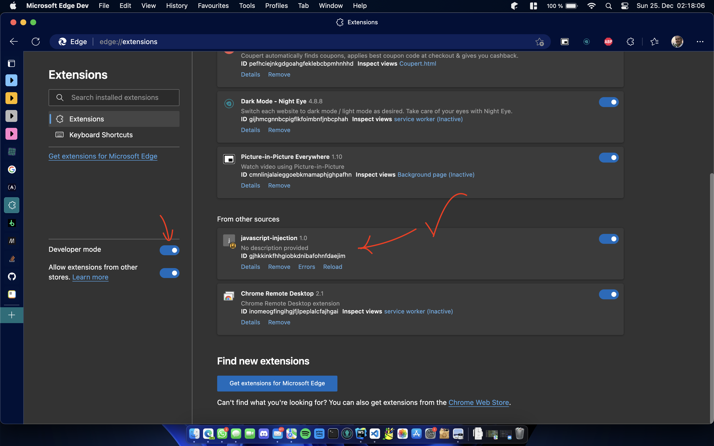

# Javascript injection

This is a simple extension where you can add javascript to any web page.
The extension removes a button from a music provider website.
This repo is just for demonstrating purposes on how to write chrome extensions.

## 1. Add the extension to your browser

## 2. Implement your own extension

Just place the code into the main.js

## 3. Reload the extension

Click onto reload in the extensions tab on the reload button you can see in the screenshot.

## 4. Profit